# Food Ordering Platform

A full-stack restaurant ordering application built with Next.js, MongoDB and Redux Toolkit. Customers browse the menu, customise products, place orders and track them; the restaurant manages the catalogue, orders and reservations from a separate admin dashboard.

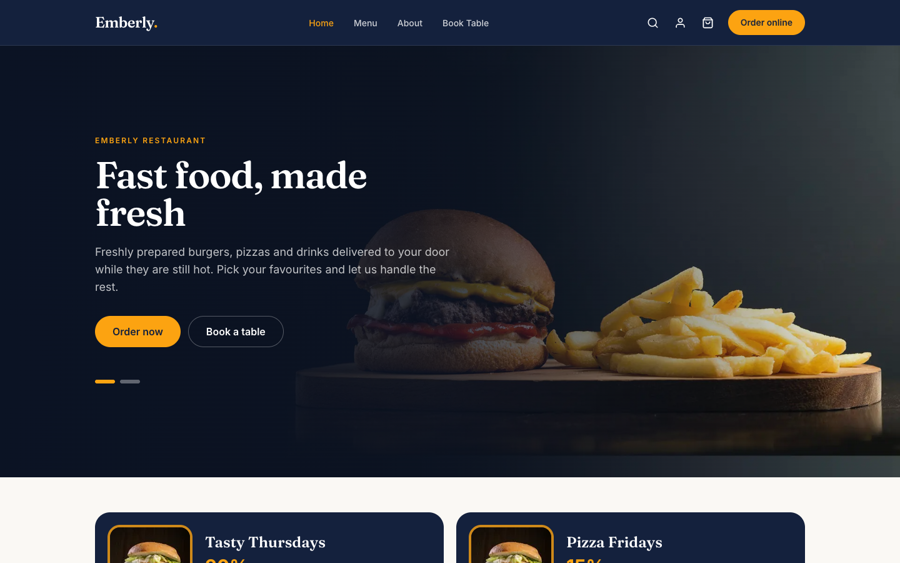

## Overview

The project is a single Next.js application (Pages Router) that serves both the storefront and its REST API. Pages that need data read it on the server with `getServerSideProps`, mutations go through API routes, and every API route is validated and authorised on the server.

## Features

**Customer**

- Menu grouped by category, with product search from the header
- Product detail with size selection and optional extras; the price updates with the selection
- Cart kept in Redux and persisted in `localStorage`, with an order summary and a confirmation step before checkout
- Order tracking page with a four-step status timeline and the ordered items
- Profile area: account details, password change and order history
- Table reservations

**Admin**

- Overview with revenue, order, product, category and reservation counts, plus recent orders
- Product management: list, search, create (with image upload to Cloudinary) and delete
- Category management: create and delete
- Order management: see ordered items and delivery address, filter by status and move an order to its next stage
- Reservation list with upcoming / past status
- Footer content management: contact details, opening hours and social links

**Authentication**

- Email and password sign-up and sign-in (NextAuth Credentials, passwords hashed with bcrypt)
- Optional GitHub sign-in, shown only when the GitHub OAuth variables are configured
- Separate admin sign-in backed by an HTTP-only cookie

## Tech Stack

| Area | Technology |
| --- | --- |
| Frontend | Next.js 16 (Pages Router), React 19 |
| Backend | Next.js API routes |
| Database | MongoDB, Mongoose |
| Authentication | NextAuth.js (Credentials + GitHub), bcryptjs, cookie |
| State Management | Redux Toolkit, React Redux |
| Validation | Formik, Yup (shared between forms and API routes) |
| Styling | Tailwind CSS, PostCSS, Autoprefixer, `next/font` |
| Other Libraries | Axios, react-slick, react-icons, react-toastify, react-spinners, NProgress |

## Architecture

- **Pages Router** – files in `src/pages` only define routes, fetch server data and compose components.
- **Components** – UI grouped by feature (`admin`, `cart`, `product`, `profile`, ...) with shared building blocks in `common` and `form`.
- **Server layer** (`src/server`) – database connection, NextAuth options, authorisation guards, request validation, rate limiting, server-side queries and `createHandler`, which gives every API route method routing, a `405` response and consistent error handling.
- **API routes** (`src/pages/api`) – thin handlers built with `createHandler`; they validate input with a Yup schema and check access with a guard before touching a model.
- **Services** (`src/services`) – the only place the client talks to the API. Components never call Axios directly.
- **Hooks** (`src/hooks`) – `useFetch` (data, loading, error, refetch, stale-response protection), `useToggle`, `useCurrentUser` and `useProductOptions`.
- **Redux** (`src/redux`) – a single `cart` slice with selectors for products, count and total, plus a small `localStorage` sync.
- **Schemas** (`src/schemas`) – Yup schemas used by Formik on the client and reused by the API routes on the server.
- **Models** (`src/models`) – Mongoose models: `User`, `Product`, `Category`, `Order`, `Reservation`, `Footer`, `RateLimit`.

## Project Structure

```
├── docs/screenshots/        README screenshots
├── public/images/           Static and sample product images
├── scripts/seed.js          Sample data for an empty database
└── src/
    ├── components/
    │   ├── admin/           AdminLayout, AdminOverview, ProductManager, OrderManager, ...
    │   ├── auth/            AuthCard
    │   ├── cart/            CartItems, CartSummary
    │   ├── common/          Modal, ConfirmDialog, DataTable, DataState, EmptyState, Seo, ...
    │   ├── form/            Input, FormFields
    │   ├── home/            HeroSlider, Campaigns, AboutSection, Testimonials
    │   ├── layout/          Layout, Header, Footer, SearchModal
    │   ├── order/           OrderStatusTracker, OrderStatusBadge, OrderItems
    │   ├── product/         MenuWrapper, MenuItem, ProductDetail, SizeSelector
    │   ├── profile/         ProfileLayout, AccountSettings, PasswordSettings, UserOrders
    │   └── reservation/     ReservationSection
    ├── constants/           Site name, navigation, form field definitions, order and product constants
    ├── hooks/               Custom React hooks
    ├── models/              Mongoose models
    ├── pages/               Routes
    │   └── api/             REST API routes
    ├── redux/               Store, cart slice and cart persistence
    ├── schemas/             Yup validation schemas
    ├── server/              dbConnect, auth, guards, validate, rateLimit, cloudinary, queries, createHandler
    ├── services/            Client-side API services
    ├── styles/              Global styles and component classes
    └── utils/               Formatting and serialisation helpers
```

## Screenshots

### Storefront

| Menu | Product Detail |
| --- | --- |
| 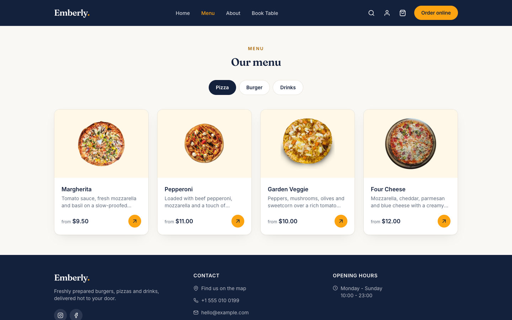 | 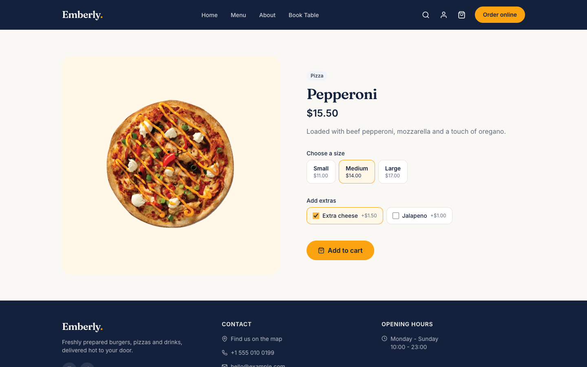 |

| Search | Cart |
| --- | --- |
| 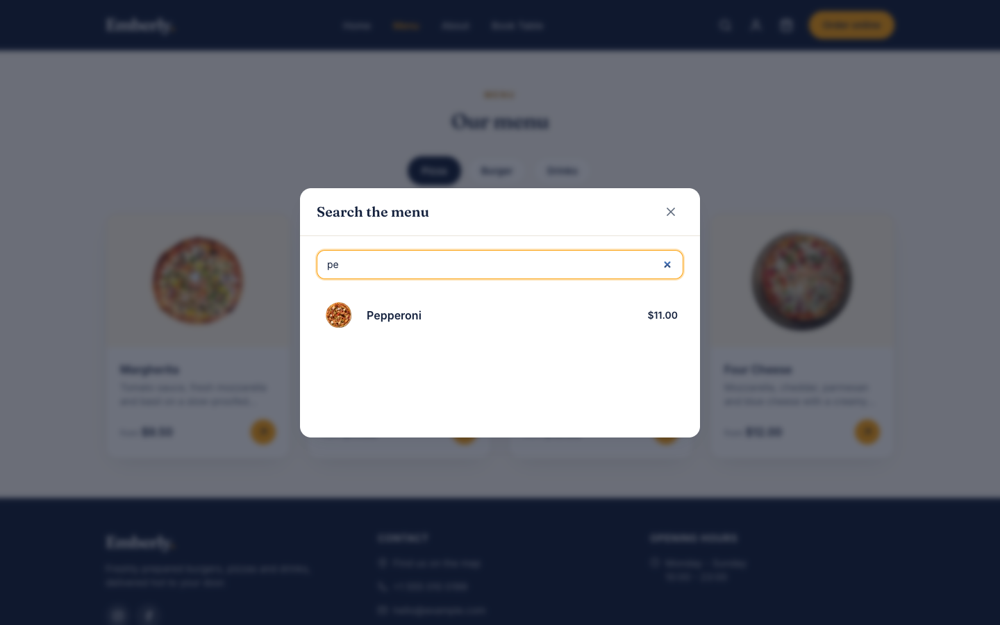 | 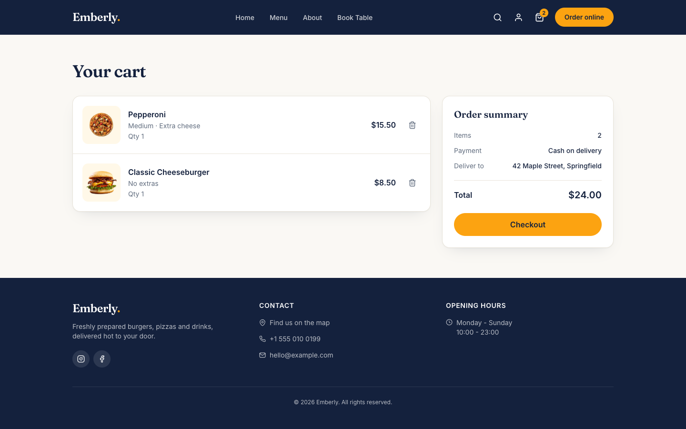 |

| Checkout | Order Tracking |
| --- | --- |
| 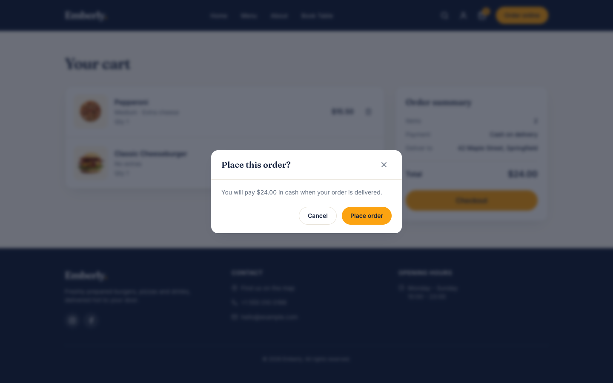 | 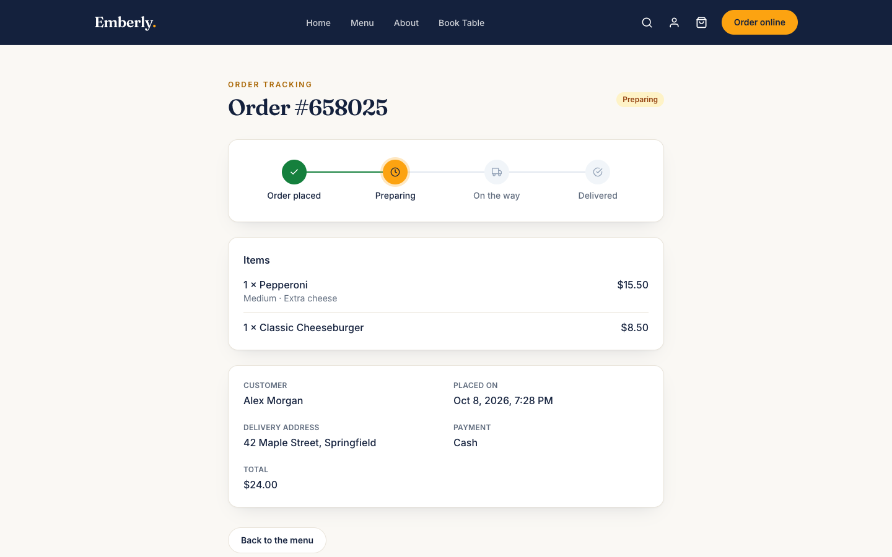 |

| Profile | Order History |
| --- | --- |
| 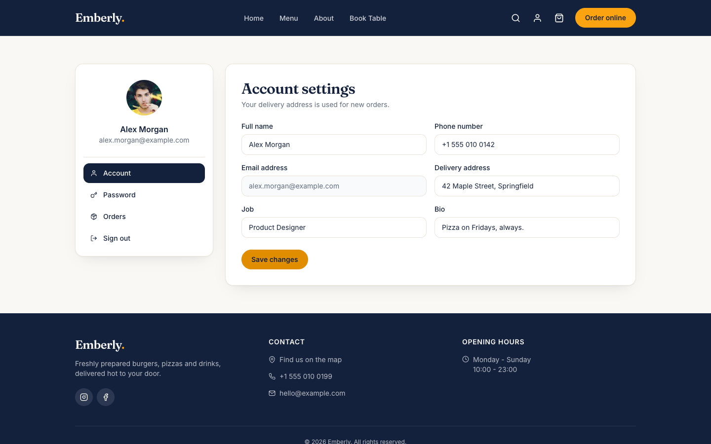 | 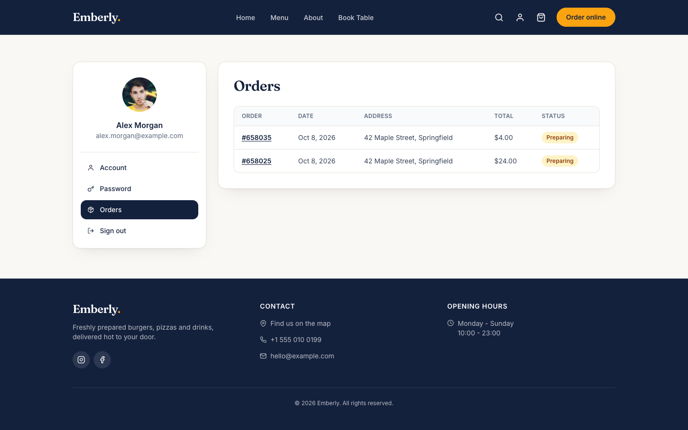 |

| Password | Reservation |
| --- | --- |
| 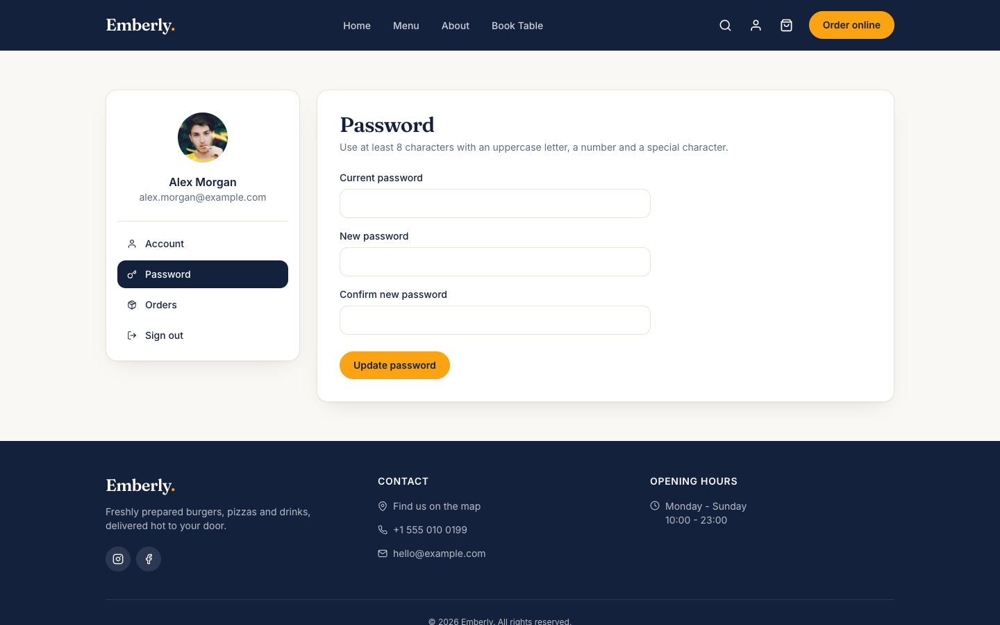 | 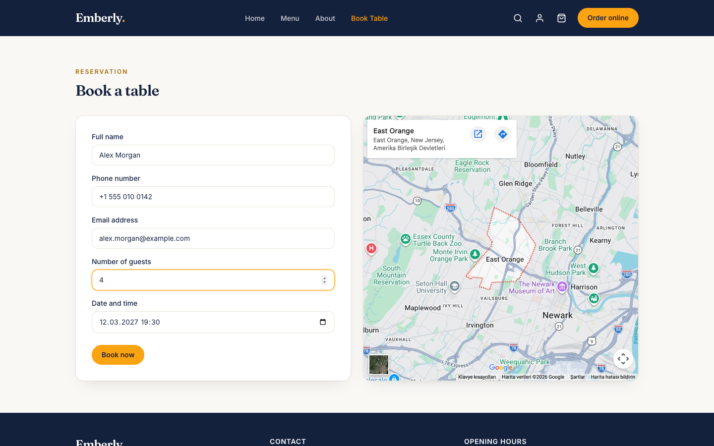 |

| Login |
| --- |
| 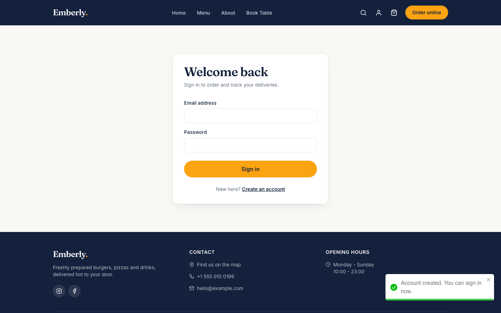 |

### Admin

| Dashboard | Order Management |
| --- | --- |
| 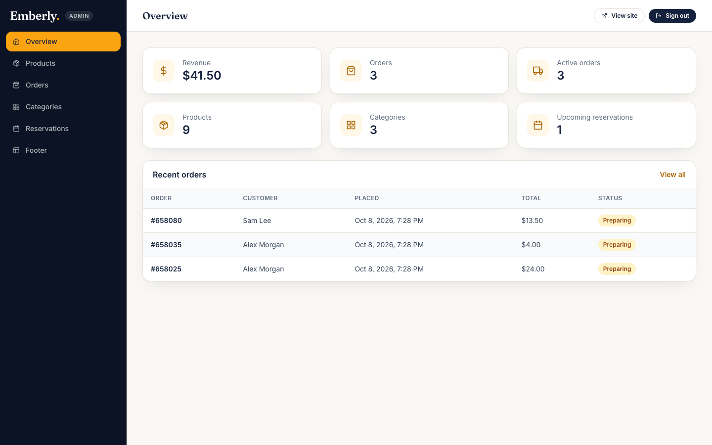 | 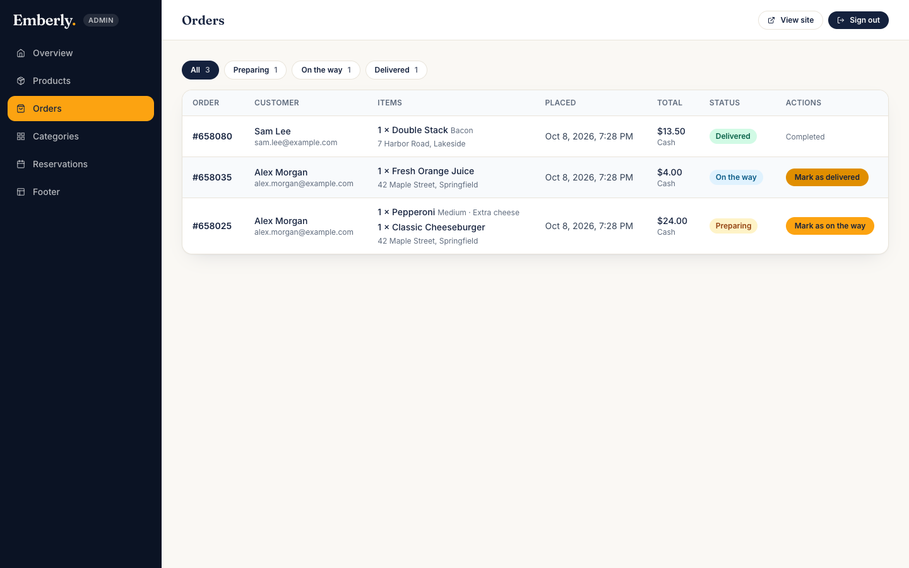 |

| Product Management | Reservations |
| --- | --- |
| 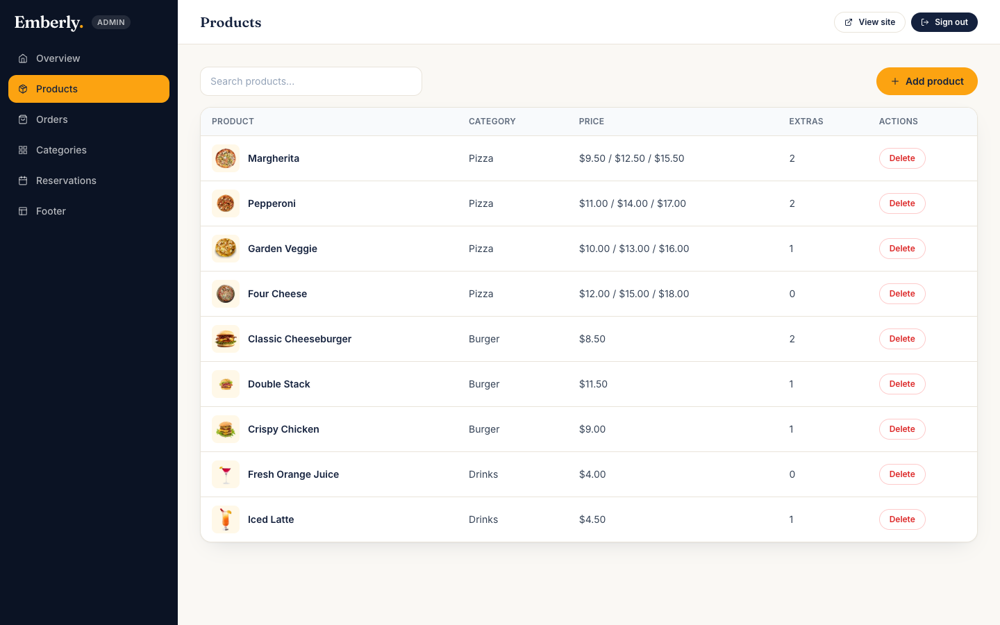 | 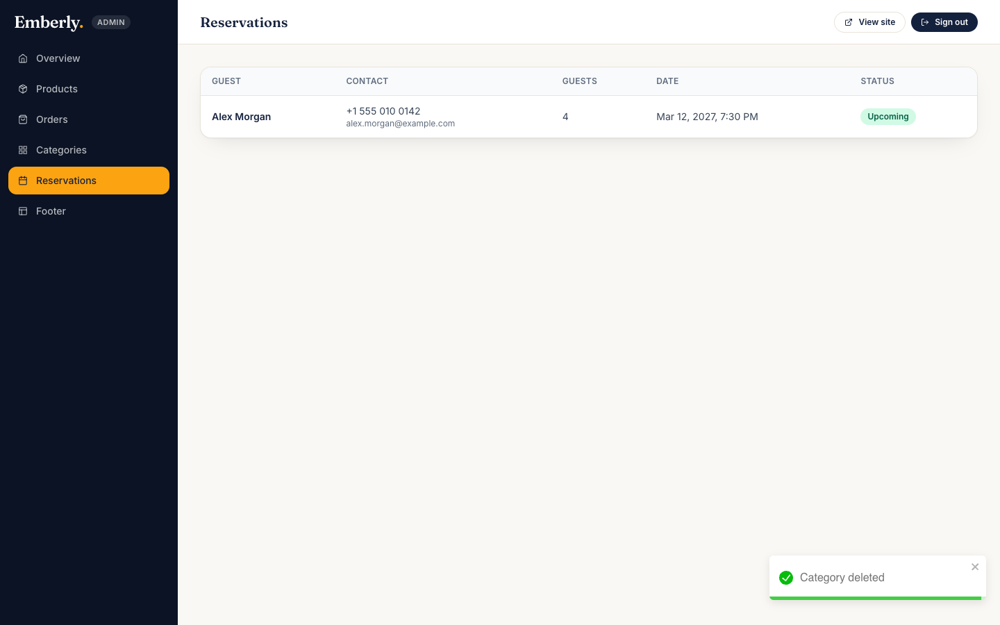 |

### Mobile

| Home | Menu | Order Tracking |
| --- | --- | --- |
|  | 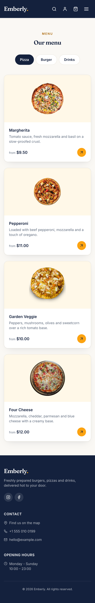 | 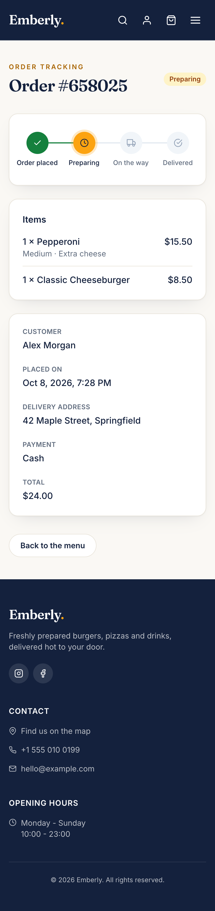 |

All screenshots use seeded sample data and placeholder accounts.

## UI Improvements

- Consistent design system: colour tokens, typography scale, buttons, inputs, cards and badges
- Sticky navigation with an accessible mobile menu
- Redesigned product cards, product detail, cart and checkout summary
- Order tracking rebuilt as a status timeline
- Dedicated admin dashboard layout with overview statistics, filters and status badges
- Loading, empty and error states for every data-driven view
- Accessible forms with visible labels, inline errors and keyboard-friendly dialogs
- Layouts verified at mobile, tablet and desktop widths

## Installation

Requirements: Node.js 20.9 or newer and a MongoDB database.

```bash
git clone https://github.com/zeynepbass/food-ordering-platform.git
cd food-ordering-platform
npm install
cp .env.example .env.local
```

Fill in `.env.local` (see below), then:

```bash
npm run seed   # optional: sample categories, products and footer content
npm run dev
```

The restaurant name shown across the site is a single constant in `src/constants/site.js`.

The storefront runs at `http://localhost:3000` and the admin dashboard at `http://localhost:3000/admin`.

## Environment Variables

| Variable | Required | Description |
| --- | --- | --- |
| `MONGODB_URI` | Yes | MongoDB connection string |
| `NEXTAUTH_URL` | Yes | Public URL of the app (`http://localhost:3000` in development) |
| `NEXTAUTH_SECRET` | Yes | Secret used to sign NextAuth session tokens |
| `ADMIN_USERNAME` | Yes | Admin sign-in username |
| `ADMIN_PASSWORD` | Yes | Admin sign-in password |
| `ADMIN_TOKEN` | Yes | Long random value stored in the admin session cookie |
| `CLOUDINARY_CLOUD_NAME` | For uploads | Cloudinary cloud name |
| `CLOUDINARY_API_KEY` | For uploads | Cloudinary API key |
| `CLOUDINARY_API_SECRET` | For uploads | Cloudinary API secret, used on the server to sign uploads |
| `GITHUB_ID`, `GITHUB_SECRET` | No | GitHub OAuth credentials; GitHub sign-in is hidden when empty |
| `NEXT_PUBLIC_API_URL` | No | API base URL, defaults to `/api` |

Secrets can be generated with `openssl rand -base64 32`. Never commit `.env.local`.

## Available Scripts

| Script | Description |
| --- | --- |
| `npm run dev` | Start the development server |
| `npm run build` | Create a production build |
| `npm run start` | Serve the production build |
| `npm run lint` | Run ESLint (`eslint-config-next/core-web-vitals`, flat config) |
| `npm run seed` | Insert sample data into an empty database |

## API

Errors are returned as `{ "message": "..." }` with an appropriate status code.

| Endpoint | Method | Access | Description |
| --- | --- | --- | --- |
| `/api/products` | GET | Public | List products |
| `/api/products` | POST | Admin | Create a product |
| `/api/products/:id` | GET | Public | Get a product |
| `/api/products/:id` | DELETE | Admin | Delete a product |
| `/api/categories` | GET | Public | List categories |
| `/api/categories` | POST | Admin | Create a category |
| `/api/categories/:id` | GET | Public | Get a category |
| `/api/categories/:id` | DELETE | Admin | Delete an empty category |
| `/api/orders` | GET | User / Admin | A user's own orders, or all orders for the admin |
| `/api/orders` | POST | User | Place an order; items and total are built on the server |
| `/api/orders/:id` | GET | Owner / Admin | Get an order |
| `/api/orders/:id` | PUT | Admin | Update order status |
| `/api/orders/:id` | DELETE | Admin | Delete an order |
| `/api/reservations` | GET | Admin | List reservations |
| `/api/reservations` | POST | Public | Create a reservation |
| `/api/footer` | GET | Public | Get footer content |
| `/api/footer` | POST | Admin | Create footer content |
| `/api/footer/:id` | GET | Public | Get footer content by id |
| `/api/footer/:id` | PUT | Admin | Update footer content |
| `/api/users?email=` | GET | Account owner | Get the signed-in user |
| `/api/users/:id` | GET · PUT | Account owner | Read or update profile details and password |
| `/api/users/register` | POST | Public | Create an account |
| `/api/uploads/signature` | POST | Admin | Signed parameters for a product image upload |
| `/api/admin` | POST · DELETE | Public | Admin sign-in / sign-out |
| `/api/auth/*` | – | Public | NextAuth endpoints |

## Security

- Authorisation is enforced on the server for every protected API route and page; the client is never trusted for access decisions.
- Admin operations require the admin cookie (HTTP-only, `SameSite=Strict`, `Secure` in production), compared in constant time.
- Users can only read and update their own profile and orders; order pages return `404` for anyone else.
- Order items and totals are built on the server from database prices; amounts sent by the client are ignored.
- Changing a password requires the current password.
- Sign-in, admin sign-in, registration and password changes are rate limited (`429` with `Retry-After`); counters are stored in MongoDB with a TTL index, so limits hold across server instances.
- Product images are uploaded with a short-lived signature issued only to the admin; the Cloudinary API secret never reaches the browser.
- Request bodies are validated with Yup schemas before reaching the database.
- Passwords are hashed with bcrypt and excluded from queries by default.
- Sign-in errors do not reveal whether an email address is registered.
- Secrets are read from environment variables; `.env*` files are git-ignored.
- Baseline security headers (`X-Content-Type-Options`, `X-Frame-Options`, `Referrer-Policy`, `Permissions-Policy`) are set in `next.config.js`.

## Performance

- Server-side data access with `getServerSideProps` and lean Mongoose queries; pages do not call their own API for the initial render.
- A cached MongoDB connection is reused across requests.
- Images are served through `next/image` with explicit `sizes`; fonts are self-hosted with `next/font`.
- `MenuItem` cards are memoised, and list updates in the admin dashboard patch local state instead of refetching.
- `useFetch` ignores stale responses, avoiding race conditions and updates after unmount.

## License

Released under the MIT License. See [LICENSE](LICENSE).
